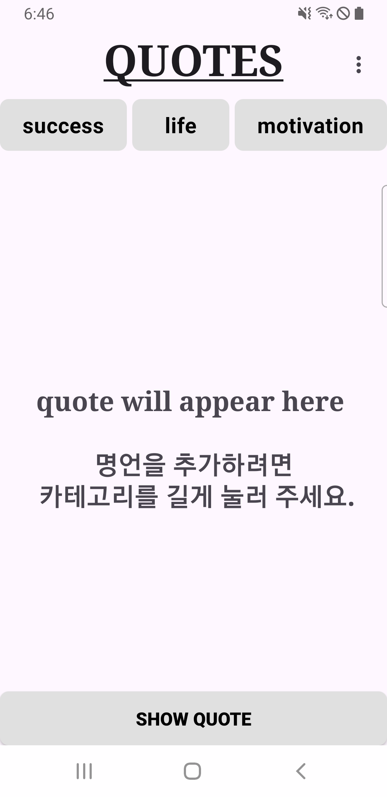

# QuotesApp

영감을 주는 명언, 동기 부여의 말, 그리고 인생의 지혜를 랜덤으로 보여주는 간단한 안드로이드 앱입니다. 카테고리를 선택하고 버튼을 탭할 때마다 새로운 명언을 확인할 수 있습니다.

## 설명

QuotesApp은 **성공**, **인생**, **동기 부여**의 세 가지 카테고리에서 랜덤한 명언을 사용자에게 제공합니다. 부드러운 페이드 인/아웃 애니메이션을 제공하여 즐겁고 유용한 사용자 경험을 제공합니다. 

## 기능

- **성공**, **인생**, **동기 부여** 카테고리에서 랜덤 명언 표시.
- 부드러운 **페이드 인/아웃** 애니메이션으로 명언 전환.
- 직관적이고 간단한 사용자 인터페이스.
- 버튼 클릭 시 새로운 명언을 보여주는 간단한 기능.

  
## Screenshots

### Home Screen

- 앱 실행 시 보이는 홈 화면.  
- 세 가지 카테고리(**Success**, **Life**, **Motivation**) 중 하나를 선택할 수 있습니다.

### Quote Categories

- 선택한 카테고리에 따라 명언이 표시됩니다.  
- 예: **Success** 카테고리를 선택한 경우.
