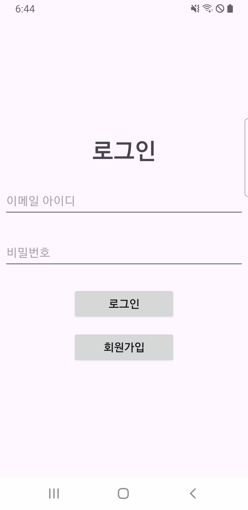
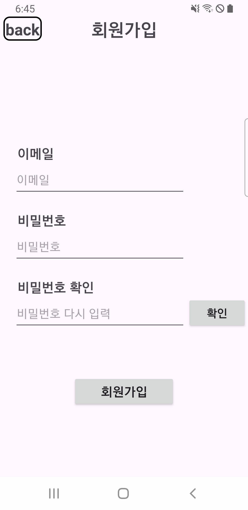
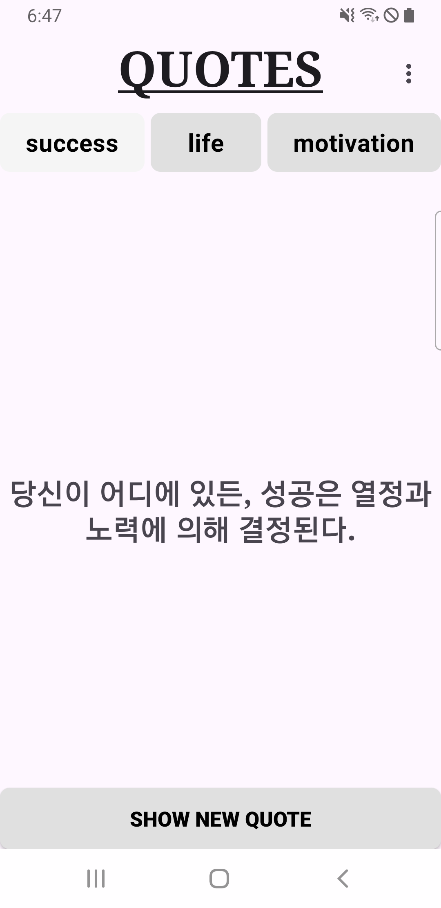
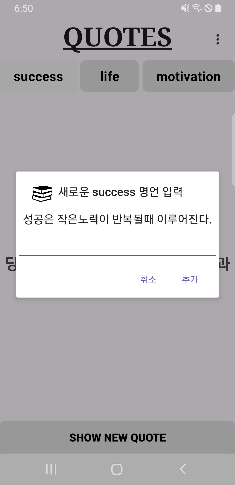
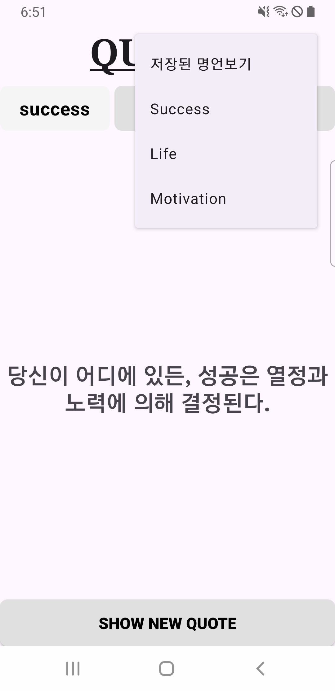
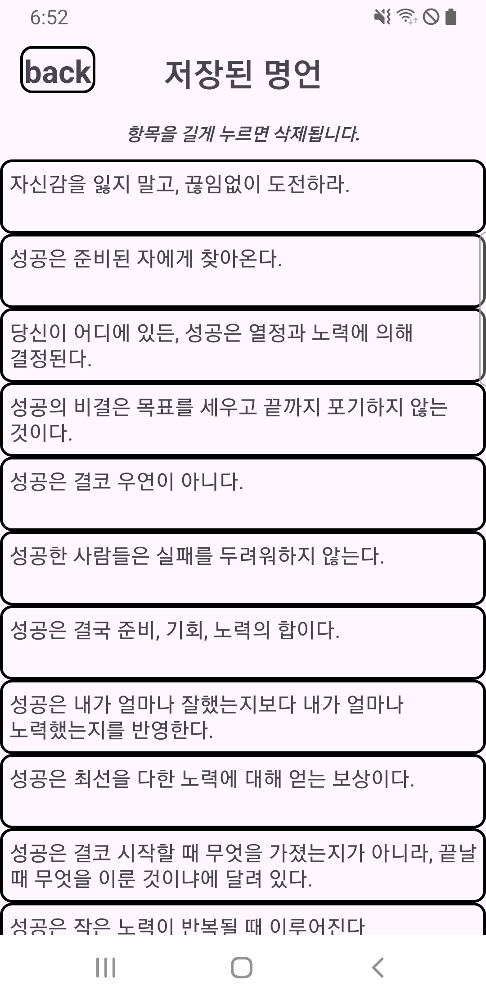

# QuotesApp

영감을 주는 명언, 동기 부여의 말, 그리고 인생의 지혜를 랜덤으로 보여주는 간단한 안드로이드 앱입니다. 카테고리를 선택하고 버튼을 탭할 때마다 새로운 명언을 확인할 수 있습니다.

## 설명

QuotesApp은 **성공**, **인생**, **동기 부여**의 세 가지 카테고리에서 랜덤한 명언을 사용자에게 제공합니다. 부드러운 페이드 인/아웃 애니메이션을 제공하여 즐겁고 유용한 사용자 경험을 제공합니다. 

## 기능

- **성공**, **인생**, **동기 부여** 카테고리에서 랜덤 명언 표시.
- 부드러운 **페이드 인/아웃** 애니메이션으로 명언 전환.
- 직관적이고 간단한 사용자 인터페이스.
- 버튼 클릭 시 새로운 명언을 보여주는 간단한 기능.

## 기술 스택

- **언어 (Languages)**: Java, XML
- **도구 (Tools)**: Android Studio
- **라이브러리 (Libraries)**: Android SDK, Firebase Authentication
- **기술 적용**:
  - **Firebase Authentication**: 로그인 및 회원가입 기능 구현
  - **SQLite**: 명언 저장 및 조회
  - **페이드 애니메이션**: 화면 전환 시 부드러운 효과 제공
  - **Random Utility**: 동적 콘텐츠 생성
  - **RecyclerView**: 명언 리스트의 성능 최적화 및 유연성 확보

## 업데이트 내역

### 업데이트 25.1.3
- **SQLite**: 앱 내 명언을 데이터베이스에 저장하고, 카테고리별로 조회 가능하게 수정.
- **명언 추가 기능**: 사용자가 직접 명언을 추가할 수 있도록 기능 추가.
- **삭제 기능 추가**: 리스트에서 선택한 명언을 삭제할 수 있도록 기능 추가.

### 업데이트 25.1.10
- **Firebase Authentication**: 앱에 로그인 및 회원가입 기능 추가.
  - Firebase를 이용해 사용자 계정 생성 및 인증 가능.
  - 로그인 상태 유지 및 로그아웃 기능 포함.

- **ListView -> RecyclerView 변경**: 앱 내 명언 리스트를 RecyclerView로 변경.
  - 성능 향상 및 더 유연한 아이템 관리 가능.
  - 롱 클릭을 통해 명언 삭제 기능 구현.

- **UI 개선**: 전반적인 사용자 경험(UX) 향상.
  - 새로운 디자인 요소 적용으로 더 직관적인 인터페이스 제공.
  - 리사이클러뷰 항목에 시각적 강조 추가.

  
## Screenshots

### Login Screen, Register Screen

  

- 이메일과 패스워드를 이용해 간단 로그인, 회원가입 기능 구현

### Home Screen

- 앱 실행 시 보이는 홈 화면.  
- 세 가지 카테고리(**Success**, **Life**, **Motivation**) 중 하나를 선택할 수 있습니다.

### Quote Categories

- 선택한 카테고리에 따라 명언이 표시됩니다.  
- 예: **Success** 카테고리를 선택한 경우.

### Add Quote

- 카테고리를 롱 클릭하면 dialog가 출력됩니다.  
- 새로운 명언을 입력하고 추가 버튼을 클릭하면 데이터베이스에 추가됩니다.

### Delete Quote

- 오른쪽 상단의 아이콘을 클릭하면 옵션메뉴가 열립니다.
- 목록을 선택하면 각 카테고리별로 저장된 명언들이 새로운 액티비티에 출력됩니다.

  

- 각 명언 항목들을 길게 클릭하면 삭제됩니다.

## 실행 화면

- 페이드 인/아웃 애니메이션으로 부드럽게 명언이 전환 됩니다.
